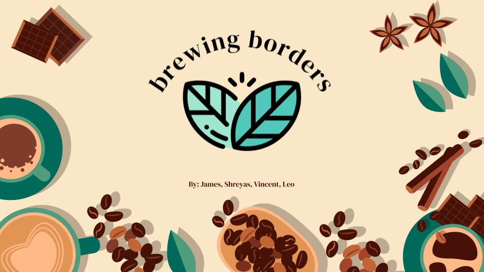
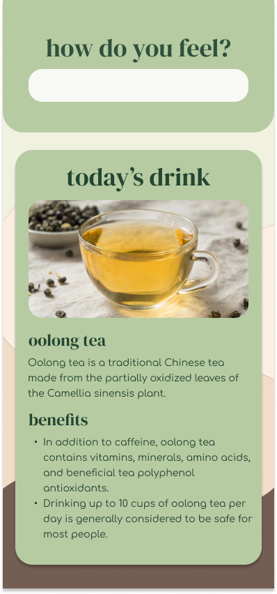
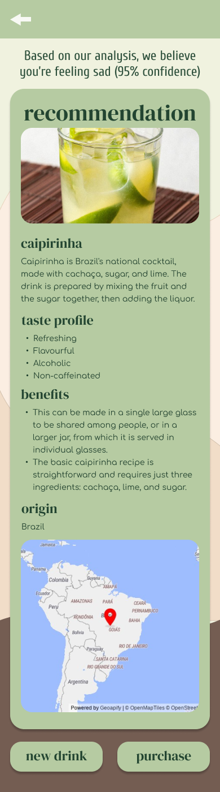
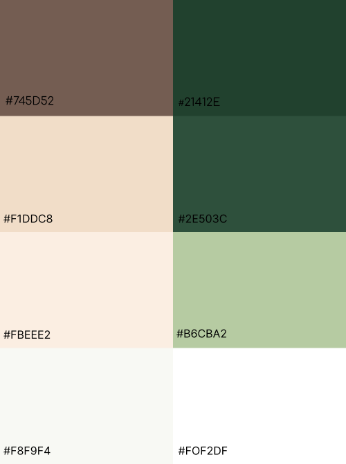

# Brewing Borders - UofT Hacks X

## Inspiration
We got a free bottle of oolong tea from UTSC and it was delicious. With the theme being exploration, we wanted to explore the different beverages around the world.

## What it does
A personalized beverage recommendation is provided based on the analysis of the user's feeling. Information about the beverage is given including the benefits, origin, and taste profile.

## How we built it
We used Flask as our frontend to get the user's input. The input is given to co:here to analyze the sentiment so we can specify different variables such as caffeine or alcohol. Those variables are used to find a drink that matches the user's needs.

## Challenges we ran into
- We weren't able to use Python with just HTML and CSS
- We've never used Flask before
- Inconsistent results from different computers

## Accomplishments that we're proud of
- Figma concept looks nice
- Created a website with Flask

## What we learned
- Some basic Flask
- co:here API for sentiment analysis

## What's next for Brewing Borders
- Turn it into a progressive web app
- Improve design of Flask frontend

## Figma Design

<!--  -->
